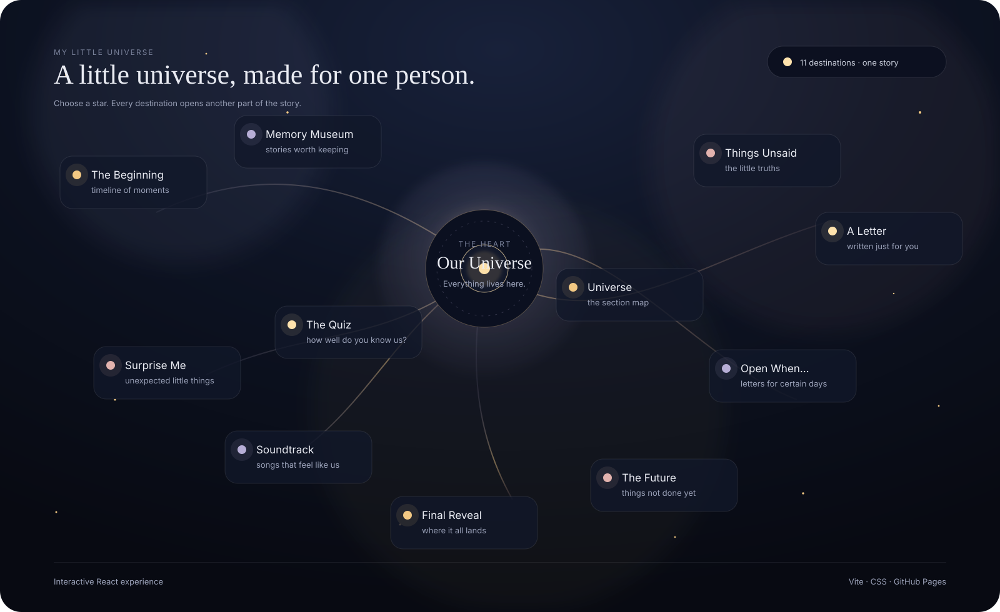

<div align="center">

# The Little Universe I Made for You

**A cinematic, interactive digital gift — built as a small universe of memories, words, music, and moments.**

<p>
  
  
  
  
  
  
</p>

<p>
  <a href="https://chillingbing648-sketch.github.io/My-Little-Universe/">✦ Live Experience</a>
  &nbsp;·&nbsp;
  <a href="https://github.com/chillingbing648-sketch/My-Little-Universe">⌘ Source</a>
</p>

</div>

---

## ✦ Technology at a Glance

The stack is intentionally lightweight: **React** handles the experience layer, **Vite** handles development and production bundling, and **CSS** carries the visual language, responsive behavior, motion, and atmosphere.

<table>
<tr>
<td width="25%" valign="top">

### ⚛ Frontend
**React 18**  
React DOM

Component-driven architecture for the individual sections, shared UI, navigation, overlays, and interactive states.

</td>
<td width="25%" valign="top">

### ⚡ Tooling
**Vite 5**  
Node.js · npm

Fast development server and production build pipeline with a minimal dependency footprint.

</td>
<td width="25%" valign="top">

### ◇ Interface
**JavaScript**  
HTML5 · CSS3

ES modules, semantic markup, responsive layouts, layered visual effects, transitions, and custom interaction styling.

</td>
<td width="25%" valign="top">

### ☁ Delivery
**GitHub Actions**  
GitHub Pages

Every production deployment is built from `main` and published as a fresh static artifact.

</td>
</tr>
</table>

### Stack

```text
React 18
├── React DOM
├── Component-based sections
└── Hash-based navigation

Vite 5
├── Development server
├── Production bundling
└── Static build output

JavaScript + HTML5 + CSS3
├── Interaction logic
├── Responsive presentation
├── Motion + transitions
└── Visual design system

Google Fonts
├── Sora
└── Fraunces

GitHub Actions
└── Automated production build

GitHub Pages
└── Static hosting
```

### Why this stack?

**Small footprint.** The project does not need a backend, database, authentication layer, or large framework surface to deliver the experience.

**Component separation.** Each destination is isolated into its own React component area, while shared behaviors live in reusable hooks and UI components.

**Design-first CSS.** The visual identity is driven through a centralized design system plus section-specific styling rather than a heavy UI framework.

**Deployment-ready by default.** The repository builds a fresh production bundle through GitHub Actions instead of storing generated `dist/` files in source control.

---

## ✧ What the Experience Includes

<table>
<tr>
<td width="50%" valign="top">

### Cosmic Navigation
A constellation-style **Universe** acts as the main map, connecting the experience's destinations through interactive stars, layered atmosphere, and section transitions.

### Memory Storytelling
The experience moves through **The Beginning**, **Memory Museum**, **Things Unsaid**, **A Letter**, and **Final Reveal** — giving different memories different visual treatments.

### Personal Interactions
**Open When...**, **The Quiz**, **Soundtrack**, **Surprise Me**, and **The Future** introduce lightweight interactions beyond reading.

</td>
<td width="50%" valign="top">

### Content-First Personalization
Names, memories, writing, media references, quiz content, songs, future plans, surprises, and settings are centralized in:

`src/data/giftData.js`

### Responsive Experience
Desktop and mobile layouts use different presentation strategies where appropriate, with mobile navigation and reduced-motion support built into the interface.

### Static by Design
There is no server-side application layer, account system, database, or backend requirement. The project builds to a static production site.

</td>
</tr>
</table>

---

## Preview

<p align="center">
  
</p>

<p align="center"><sub>The latest Universe / sections experience — the navigation layer for the entire gift.</sub></p>

---

## The Concept

**The Little Universe** is designed as a single-page digital experience rather than a conventional website.

The opening presents the gift as a private space. From there, the visitor enters a constellation of destinations, where each star leads to a different kind of memory or interaction.

### Experience Map

| Destination | Purpose |
|---|---|
| **Universe** | Interactive constellation map and section navigation |
| **The Beginning** | Chronological memory timeline |
| **Memory Museum** | Exhibit-style memories with photo viewing |
| **Things Unsaid** | Small thoughts revealed through interactive cards |
| **A Letter** | A paper-style personal letter |
| **Open When...** | Conditional letters with optional date locks |
| **The Quiz** | A lightweight shared-memory quiz |
| **Soundtrack** | Songs, covers, explanations, and optional playback |
| **Surprise Me** | Randomized little messages and memories |
| **The Future** | Things to do, plus abstract destinations |
| **Final Reveal** | Closing message and final memory |

---

## Design Direction

The interface is built around a **warm midnight / starlight** visual language:

- deep midnight backgrounds instead of pure black
- restrained gold, blush, and lavender accents
- editorial serif typography paired with a modern sans-serif UI
- soft panels, paper textures, halos, and constellation lines
- motion used as storytelling rather than decoration

The aim is to make navigation feel like **moving through a place**, not clicking through a collection of pages.

---

## Architecture

```text
React App
│
├── App.jsx
│   └── Hash-based section routing
│
├── components/
│   ├── Opening/
│   ├── Universe/
│   ├── Timeline/
│   ├── MemoryMuseum/
│   ├── Unsaid/
│   ├── Letter/
│   ├── OpenWhen/
│   ├── Quiz/
│   ├── Soundtrack/
│   ├── Surprise/
│   ├── Future/
│   ├── FinalReveal/
│   ├── Navigation/
│   ├── PhotoViewer/
│   └── UI/
│
├── data/
│   └── giftData.js
│       └── Content + settings
│
├── hooks/
│   └── Reusable interaction behavior
│
├── styles/
│   ├── global.css
│   └── sections.css
│
└── public/
    ├── memories/
    ├── photos/
    ├── music/
    └── icons/
```

### Runtime Flow

```text
Opening
   ↓
Universe
   ↓
Hash route
   ↓
Section component
   ↓
Shared navigation + transitions + music + Easter eggs
```

There is no server-side application layer. The experience is delivered as a static React build.

---

## Personalize It

The project intentionally keeps personal content separate from presentation code.

Edit:

```text
src/data/giftData.js
```

That file contains the configurable content for:

- names
- opening text
- timeline entries
- museum exhibits
- unsaid thoughts
- letter content
- Open When messages and unlock dates
- quiz questions and answers
- songs
- future plans
- surprise messages
- final reveal
- settings and Easter eggs

You normally should not need to edit the components to personalize the experience.

### Add Media

Place files in:

```text
public/memories/
public/photos/
public/music/
```

Use repository-safe relative references such as:

```js
'./memories/memory-01.jpg'
'./photos/song-01.jpg'
'./music/our-song.mp3'
```

Missing media is handled with placeholders or hidden playback controls instead of taking down the rest of the experience.

---

## Run Locally

Requires Node.js 18+.

```bash
npm install
npm run dev
```

For a production check:

```bash
npm run build
npm run preview
```

---

## Deployment

The repository is deployed through **GitHub Actions → GitHub Pages**.

```text
main
 ↓
GitHub Actions
 ↓
npm ci
 ↓
npm run build
 ↓
fresh dist/
 ↓
GitHub Pages
```

The generated `dist/` directory is intentionally **not committed** to the repository. It is produced fresh by CI for each deployment.

Deployment workflow:

```text
.github/workflows/deploy.yml
```

---

## Project Structure

```text
.
├── .github/workflows/deploy.yml
├── public/
│   ├── memories/
│   ├── photos/
│   ├── music/
│   └── icons/
├── src/
│   ├── components/
│   ├── data/
│   ├── hooks/
│   ├── styles/
│   ├── App.jsx
│   └── main.jsx
├── index.html
├── package.json
├── vite.config.js
└── .gitignore
```

---

## Engineering Notes

**Hash navigation** keeps the experience inside a single-page runtime while still allowing direct section URLs.

**Content/data separation** keeps personal writing and media references in one place, reducing the need to modify presentation code.

**Graceful media handling** prevents a missing image or audio file from breaking the overall experience.

**Reduced-motion support** respects the visitor's system preference and the project's own particle setting.

**Responsive visual complexity** lets the desktop universe carry the richer constellation treatment while the mobile layout switches to a simpler section list.

---

## Accessibility & UX

The project includes:

- keyboard-focus states for interactive controls
- semantic buttons for interaction
- minimum touch-friendly control sizes
- responsive mobile navigation
- reduced-motion handling
- visible state changes for active, selected, and playing elements

---

## Roadmap

The current repository is intentionally focused on the core static experience.

Potential future additions can live here without changing the central structure:

```text
• richer personal media
• more memory exhibits
• additional Open When letters
• expanded soundtrack collection
• more interactive hidden details
```

These are **future ideas**, not claims about functionality already implemented.

---

## License

Personal / private project.

The source structure is shared for reference and experimentation; personal content and media should be replaced with your own when creating another version.

---

<div align="center">

### Made as a place to keep the little things that matter.

**The Little Universe I Made for You** · React + Vite

</div>
